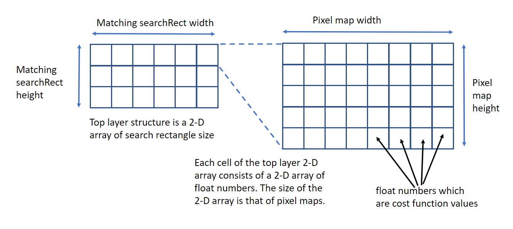

# Design of `ZnccHalf` and `CostMapGen`
Generally template matching algrithm are fed with two source images.
One is a base image, which is usually seen by a left-camera and is fixed in searching best matching points.
Another is a shifted image, which is usually seen by a right-camera and is shifted in searching best matching points.
`ZnccC/ZnccHalfC` and `ZnccISPC/ZnccHalf` consists of 
* local standard deviations
* luminance local mean over a sum-rect,
* luminance deviations from their local mean,
<br>
Note: True ZNCC algorithm require the local mean in creating cost maps but this quasi-ZNCC algorithm
does not. This quasi-ZNCC algorithm creates the third list item above, 'luminance deviations from their local mean' instead.

Each ZNCC matcher has two ZnccHalf objects. One is of a base image. Another is of a shifted image.

# CostMapGen, cost map generator
Is is an algorithm-only module which does not have any dominant data structure.
`ZnccC/CostMapGenC.c` is C version implementation. `ZnccISPC/CostMapGen.ispc` is ISPC version implementation.
These functions are most time-consuming in ZNCC template matching algorithms.

Table 1. Methods creating cost maps
Source file | Function | Description
--|--|--
`ZnccC/CostMapGenC.c` | CostMapGenC_FillCostMap | Single threaded simplest implementation in C
`ZnccISPC/CostMapGen.ispc` | CostMapGen_Fill | Single threaded simplest implementation in ISPC
`ZnccISPC/CostMapGen.ispc` | CostMapGen_FillByTasks | Multi-threaded fast implementation in ISPC
<br>

Their program structures are same and described below pseudo code. The outer-most loop is over a search rect.
The inner-most loop is over a pixel map.
```
// two dimensions of outer loops are over a searchRect
foreach (searchRect.row)
{
    foreach (searchRect.column)
    {
        Point2i searchPoint = { searchRect.column, searchRect.column };

        // Create a cross-product map of luminance deviations of a base image and shifted image.
        // The shifted image pixel is shifted by the search point.
        Image xprodMap;
        CreateCrossProductMap(xprodMap, searchPoint);
        
        // two dimensions of inner loops are over pixelMaps.
        foreach (pixelMap.row)
        {
            foreach (pixelMap.column)
            {
                Point2i pixelPoint = { pixelMap.column, pixelMap.row };
                CostMap[searchPoint.row][searchPoint.column][pixelPoint.row][pixelPoint.column] =
                    CalculateCost(pixelPoint, searchPoint, xprodMap,
                        baseDeviationMap, shiftedDeviationMap,
                        baseStddevMap, shiftedStddevMap);
            }
        }
    }
}
```
`CostMap` is a four dimensional array of `float` numbers proportional to local cross correlations
of base luminance deviations and shifted luminance deviations. `searchPoint` moves over a search rect.
Cost value in a search rect plane in the `CostMap` has its maximum at the best match search point.
Serch algorithm is applied later. The search algorithm is implemented in `ZnccC/CostMapC.c` and
`ZnccISPC/CostMap.ispc`.  
<br>
Placing `searchRect` loop outer and `pixelMap` loop inner, summed area table can be used to calculate
local cross correlation at each search point. In this case, applying summed area table helps reduce processing time.
`CostMap` layout is `searchPoint`-major where `searchPoint`-major means like matrix row-major.
`CostMap` layout can be eigher of `searchPoint`-major or `pixelPont`-major.
Adopting `pixelPoint`-major, ISPC compiler emits performance warning and I adopted
`searchPoint`-major layout both in C and in ISPC.
<br>
  
Figre. CostMap structure  
<br>
